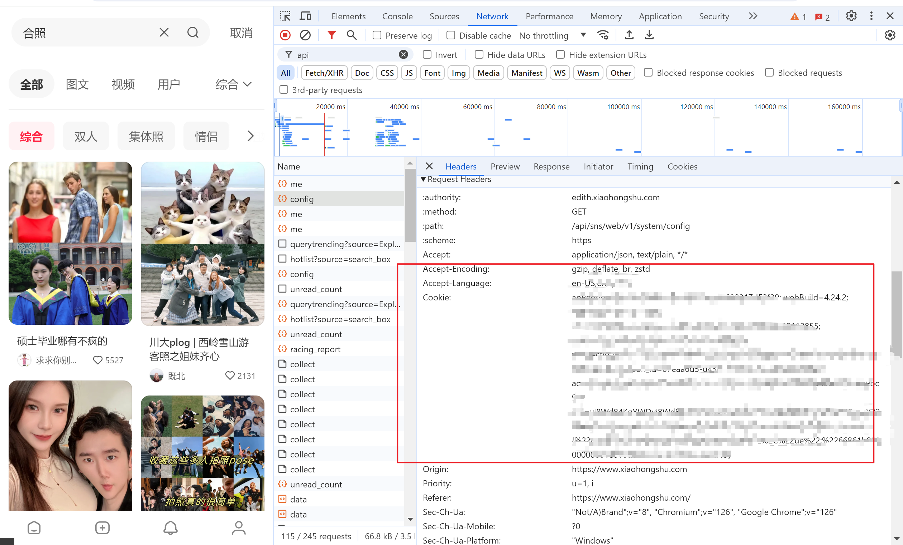

## 准备工作

### 环境配置

安装 Anaconda 或者 Miniconda 等 Python 环境管理工具。

```bash
conda create -n mediacrawler python=3.9
conda activate mediacrawler
pip install -r requirements.txt
```

### 安装 playwright 浏览器驱动

```bash
playwright install
```

## 小红书

小红书使用手机登录、二维码登录之后大概率会出现极其逆天的双重验证，由于其日益升级反爬机制，另外可能出现看似登录但爬虫无法返回任何 Data 的情况。所以，最好使用 Cookie 登录。

Cookie 登录方法如下：
1. 登录小红书
2. F12 进入浏览器控制台，然后点击 Network，任意选择一个 API 接口，点击 Headers 选项卡，找到 Cookie 字段，复制所有内容。
3. 将 Cookie 内容粘贴到 `base_config.py` 文件中。 

如果之前已经使用过爬虫，需要把 `browser_data` 下的对应平台目录删掉，小红书删除 `xhs_user_data_dir` 即可。

如图所示：



如果使用 Cookie 之后还是提示需要二次验证，则需要手动搜索关键词后手动二次验证，之后同样的方法获取 Cookie 之后更新之。

另外，小红书可以得到 JSON 之后再对图片进行下载，这样似乎比较稳妥。目前也没有遇到封 IP 的问题。 

推荐配置如下（其他配置保持不变）：

```python
PLATFORM = "xhs"
KEYWORDS = ""  # 填入搜索关键词
LOGIN_TYPE = "cookie"  # 使用 Cookie 登录
COOKIES = ""  # 填入 Cookie 内容
CRAWLER_TYPE = ("search" )

START_PAGE = 1  # 填入起始页
CRAWLER_MAX_NOTES_COUNT = 1000  # 最大条目数，设置为 1000 目前没遇到什么问题
MAX_CONCURRENCY_NUM = 1  # 并发数为 1 比较保险
```

在搜集的时候其实只需要不断改变关键词即可，然后运行 `python main.py` 即可。PS. 每一次爬取之后，记得将 `data/xhs/json` 下爬取的 JSON 文件重命名，否则新的爬取可能会覆盖原 JSON 文件。推荐命名方式：`keyword_maxnotescount_endpage.json`。比如搜索关键词为「合照」，最大条目数为 1000，爬取结束页为 11 后面的结果全为空，那么 JSON 文件名命名为 `合照_1000_11.json`。

使用 `python parse_json.py --json_dir data/xhs/json --output_dir data/docs/xhs/xhs_links.txt` 将所有 JSON 文件里面的图片链接合并为一个 txt 文件。

使用 `python download_img.py --txt_dir data/docs/xhs --output_dir data/imgs/xhs --platform xhs` 下载所有存在的 txt 文件中的所有图片链接。可以添加 `--max_concurrent` 来修改下载的并发数。

## 微博

### --- 该方法不稳定，请优先下文中介绍的另一个代码库进行爬取 ---

微博可以用同样的方式设置 Cookie 登录，无法像小红书一样得到 JSON 之后再对图片进行下载，图片如果多次重复下载可能会封 IP 但似乎只针对单张图片。

推荐配置如下（其他配置保持不变），微博的搜索结果比较多，可以修改起始页继续爬取图片：

```python
PLATFORM = "wb"
KEYWORDS = ""  # 填入搜索关键词
LOGIN_TYPE = "cookie"  # 使用 Cookie 登录
COOKIES = ""  # 填入 Cookie 内容
CRAWLER_TYPE = ("search" )

START_PAGE = 1  # 填入起始页
CRAWLER_MAX_NOTES_COUNT = 1000  # 最大条目数，设置为 1000 目前没遇到什么问题
MAX_CONCURRENCY_NUM = 1  # 并发数为 1 比较保险
```

### --- Update 2024-07-10 ---

另外一个爬取微博的库 [WeiboSpider](https://github.com/nghuyong/WeiboSpider?tab=readme-ov-file) 使用了更简洁的代码并且支持得到 JSON 之后再对图片进行下载。同样使用 Scrapy 框架，所以可以在 [ApiCrawler](https://github.com/why-q/ApiCrawler) 的环境下操作即可。**请确保依照官方 README 文档进行了相关配置。**

爬取后使用 `python parse_json.py --platform weibo --json_dir dir/to/json --trans_dir dir/to/save/trans_json --output_path path/to/output` 可以将所有的 JSONL 文件转换成 JSON 文件并且将其中所有的图片链接合并为一个 txt 文件。

之后使用上文介绍的 `python download_img.py` 命令下载图片即可。